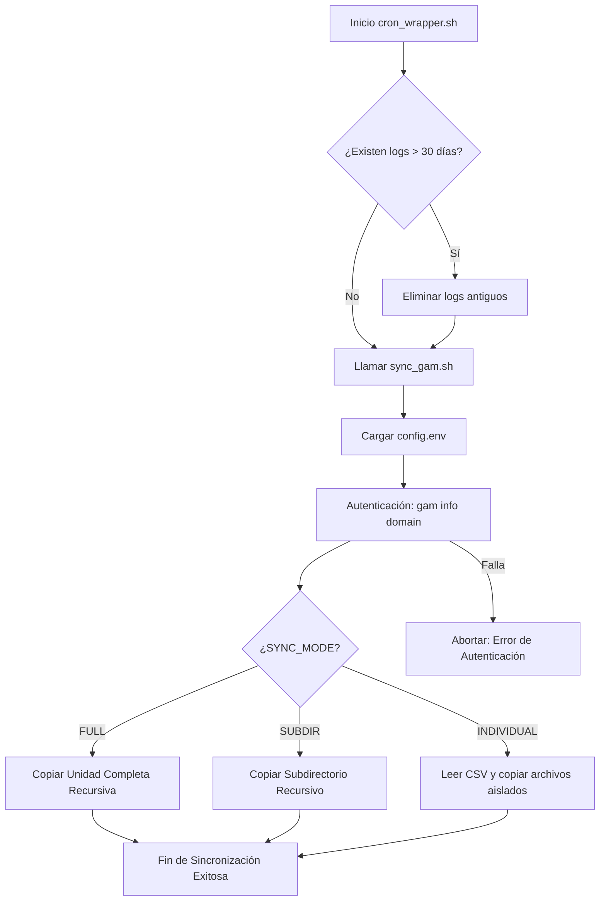

# Sincronización Automática GAM (POC)

## Objetivos
El objetivo principal de este proyecto es proveer una Prueba de Concepto (POC) para automatizar la clonación y sincronización incremental de archivos desde una Unidad Compartida de acceso restringido hacia una Unidad Compartida de acceso externo en Google Workspace. 

Conceptos que practica este proyecto:
- **Automatización de procesos backend** y manejo de variables de entorno con Bash.
- **Interacción robusta con APIs de Google Drive** a través de la interfaz de la herramienta GAM.
- **Harness Engineering y Control de Flujos** (manejo de errores nativos, rotación de logs por antigüedad y ejecución desatendida).

## Estructura de Archivos
```text
belat_shared_drives/
├── config/
│   └── config.env             # Archivo central de variables (IDs, usuario admin, modos).
├── data/
│   └── items.csv              # Plantilla CSV para copiado de elementos individuales puntuales.
├── docs/
│   └── checklist_produccion.md# Guía para el paso seguro de esta POC a Producción.
├── logs/                      # Directorio de recolección de logs de las sincronizaciones.
├── scripts/
│   ├── cron_wrapper.sh        # Script envolvente para limpieza de logs y ejecución desatendida.
│   └── sync_gam.sh            # Script y motor principal de la sincronización GAM.
├── agent.md                   # Reglas del Agente y gobernanza del proyecto.
├── memory.md                  # Registro de decisiones de arquitectura y soluciones técnicas (ADR).
├── spec.md                    # Especificaciones técnicas y flags utilizados.
└── tasks.md                   # WBS, checklist y control de tareas del proyecto.
```

## Diagrama de Flujo del Proceso


## Secciones del "Sitio" (Componentes Lógicos del Script)
*(Adaptación estructural a un entorno Backend / CLI)*
- **Header / Inicialización:** Etapa temprana en el código donde el script ubica su directorio real, carga dinámicamente la configuración desde `config.env` y valida que el binario de GAM exista y el token de Google Workspace tenga sesión activa.
- **Hero / Motor Central (Modos de Copiado):** Bloque lógico principal (`case/esac`) que actúa como núcleo de la herramienta. Redirige el flujo hacia la función correspondiente (`mode_full`, `mode_subdir`, `mode_individual`). Es quien inyecta la bandera clave `duplicatefiles overwriteolder`.
- **Categorías / Logs de Salida:** Componente transversal que captura todas las salidas (Stdout/Stderr) mediante "tuberías" (`tee`) guardando eventos limpios con marcas de tiempo en el directorio `/logs`.

## Tecnologías
- **Bash Shell Scripting:** Lenguaje del sistema base empleado para la automatización y control del sistema de archivos.
- **GAM (Google Apps Manager) v7:** Herramienta de línea de comandos en Python conectada a la API de Google, encargada de la transferencia de datos.
- **Cron (Linux):** Sistema agendador de tareas proyectado para su fase productiva.

## Instalación y Uso
1. **Configurar GAM:** Asegurarse de tener la herramienta `gam` inicializada y autenticada (`oauth`) en el equipo.
2. **Clonar repositorio:** Ubicar toda esta estructura de archivos en un directorio de ejecución.
3. **Parametrizar (El paso más importante):** Editar `config/config.env` especificando tu cuenta administradora de Google Workspace, el modo de ejecución (`FULL`, `SUBDIR` o `INDIVIDUAL`), y pegando los correspondientes Google Drive Folder IDs de origen y destino.
4. **Ejecutar Manual (Prueba):** 
   ```bash
   ./scripts/sync_gam.sh
   ```
5. **Programación Diaria:** (No recomendado para el entorno POC local actual). Agregar al crontab del servidor Linux la ejecución apuntando a `cron_wrapper.sh`.

## Paleta de Colores y Tipografías
*Nota: Al tratarse de una herramienta 100% Backend ejecutada vía interfaz de línea de comandos (CLI), no utiliza hojas de estilos CSS ni un DOM web.*
- **Tipografías:** El sistema hereda automáticamente la fuente monoespaciada configurada en la consola del operador (ej. `Ubuntu Mono`, `Courier New`, o `Consolas`), manteniendo el estándar de tamaño de su TTY.
- **Colores:** Se emplea el contraste por defecto del terminal (blanco/negro), con toda la información valiosa siendo registrada en formato texto plano en `.log` para asegurar la legibilidad del dato sin importar el tema del sistema.

## Aprendizajes Clave y Reflexión Técnica
1. **El peligro de las Sub-Shells Interactivas en Scripts Desatendidos:** Descubrimos experimentalmente que forzar un entorno iteractivo (`bash -ic`) dentro de un script bash sin un usuario supervisando causa problemas severos de "Job Control" en Linux. El sistema pausa el proceso y lo envía a segundo plano con una señal de Stop. Fue necesario refactorizar este componente para resolver la ruta al binario absoluto en lugar de confiar en que la shell interactiva cargase el alias de bash.
2. **Homogeneidad de Comandos vs Fork:** Al operar con herramientas Open-Source (GAM v7 y GAMADV-XTD3), descubrimos que algunos comandos (`gam oauth check`) estaban deprecados o inexistentes según el fork utilizado por el entorno local. Esto enseñó que las comprobaciones de salud del agente (`health-checks`) deben depender de los comandos más básicos y universales posibles, como lo es `gam info domain`, para salvaguardar la estabilidad de las automatizaciones de infraestructura ante migraciones.
